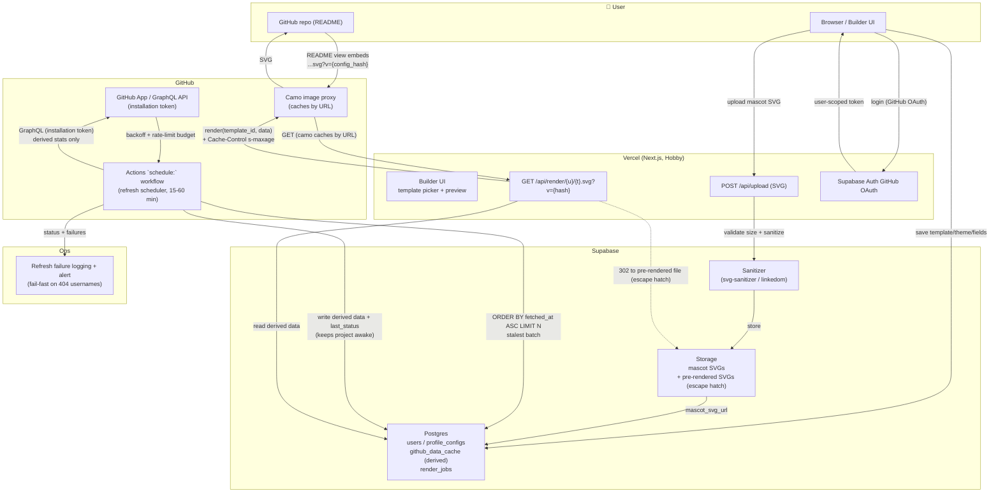

# GitHub README Generator — Phased Build Plan

## 0. Research Findings (informing every phase below)

**SVG Editing**

- Don't build a full vector editor. SVGEdit (`@svgedit/svgcanvas`, MIT) is the mature option if you ever want full draw/edit tools, but your actual need — "let a user swap in their own mascot SVG" — is a much narrower problem: *upload → sanitize → validate → slot into a template's* `<g>` *placeholder*. Build that yourself; it's safer and simpler than embedding a general editor.
- User-uploaded SVG is an XSS vector. Any uploaded SVG must be sanitized server-side (strip `<script>`, `on*` event handlers, `<foreignObject>`, external `xlink:href` references) before it's stored or composed into a template. Use a library like `DOMPurify` (with SVG profile) or `svg-sanitizer` — never trust raw uploads.
- Composition strategy: templates should define a fixed "slot" (viewBox region + max bounding box) where the mascot goes. On upload, normalize the user's SVG viewBox/scale to fit that slot programmatically rather than trusting their original dimensions.

**GitHub API**

- Use GraphQL (`api.github.com/graphql`), not REST, for anything beyond trivial lookups — one query can pull profile, contribution calendar, top languages, and pinned/starred repos at once instead of many REST calls.
- Rate limits: 5,000 points/hour per authenticated user token; GitHub App installations can get more (up to 12,500/hr) and scale with repos/users. Register as a **GitHub App**, not a bare OAuth app — better limits, badge eligibility, and finer permission scoping.
- No ETag support on GraphQL — cache responses yourself, keyed by (query + variables hash).
- Prefer webhooks over polling where possible; for public profile stats (no webhook available for "user pushed a commit" at accounts you don't own), a scheduled refresh is the fallback — see Phase 5.
- **Developer Program Member badge**: earned by being a registered GitHub Developer Program member building an app that uses the GitHub API — this tool qualifies once registered. Verify current sign-up steps at docs.github.com before launch, as program details can change.

---

## Phase 1 — Scope & Validation (1 week)

- Define the v1 template set: start with 2 templates max (e.g., fastfetch-style + one other) rather than all four we prototyped — ship narrow, expand later.
- Decide the **customization surface** for v1: text fields (name, role, stats, projects) + color theme + optional mascot upload. Don't promise full drag-and-drop layout editing yet.
- Validate demand cheaply: post the 2-3 SVGs we've already built (arcade, fastfetch, terminal) on Reddit r/github or dev Twitter/X as static examples, gauge interest before building the platform.

## Phase 2 — Data Model & Architecture (Serverless / Free-Tier Stack)

**Stack decision: single Next.js app on Vercel, Supabase for auth/db/storage. No separate cache layer, no FastAPI, no AWS, no self-hosted anything for v1** — HTTP/CDN cache headers + `fetched_at` staleness checks cover the load (Upstash deprecated for v1; see cache row below).

| Layer                      | Choice                                                                              | Replaces                    | Notes                                                                                          |
| -------------------------- | ----------------------------------------------------------------------------------- | --------------------------- | ---------------------------------------------------------------------------------------------- |
| Frontend + API             | Next.js (API routes / Route Handlers) on Vercel                                     | FastAPI + separate frontend | One codebase, one deploy, free Hobby tier                                                      |
| Auth                       | Supabase Auth (GitHub OAuth)                                                        | NextAuth.js                 | Yields a *user-scoped* token for the logged-in user; app-level fetches use the GitHub App installation token instead (Phase 3) |
| Database                   | Supabase Postgres                                                                   | Self-hosted Postgres        | Free tier; **pauses after ~1 week idle**, needs wake-up call before relying on it live         |
| File storage               | Supabase Storage                                                                    | AWS S3                      | Same bucket/URL pattern for uploaded mascot SVGs                                               |
| Cache + staleness tracking | Postgres `fetched_at` + HTTP cache headers | Upstash Redis / Self-hosted Redis | No dedicated cache for v1 — cache headers + a `fetched_at` staleness check cover the load; reintroduce Upstash only if invocation/caching load demands it |
| Background refresh         | GitHub Actions `schedule:` workflow running against Supabase + GitHub API directly | BullMQ / Celery workers     | No long-running workers in serverless; Vercel Cron Jobs are Pro-only — Actions is free, has no function timeout, and its DB writes keep Supabase awake |
| CI/CD                      | Vercel's git-push auto-deploy                                                       | GitHub Actions + GHCR       | No Docker image needed since there's no container to build                                     |

**Core tables (Supabase Postgres)**: `users` (Supabase Auth handles this natively), `profile_configs` (template_id, theme, field values, mascot_svg_url), `github_data_cache` (username, **derived profile fields only** — the handful of numbers a template needs, *not* raw GraphQL JSON — plus fetched_at, etag_key, and `last_status`/failure counter for fail-fast), `render_jobs` (status, last_run, next_scheduled). Keep `github_data_cache` lean: the free tier caps at ~500MB and a full contribution-calendar payload per user blows that ceiling within a few hundred users.

Design the SVG templates as **parameterized functions** (JS/TS template literals or a small templating helper), not static files: `render(template_id, data): string`.

**Known free-tier constraints to design around now, not later:**

- **Vercel Hobby has no Cron Jobs (Pro feature)** — the refresh scheduler is a GitHub Actions `schedule:` workflow, not a Vercel cron (see Phase 5). That workflow runs the refresh *directly* against Supabase + GitHub API, so it's free, has no 10s timeout, and its DB writes double as the Supabase keep-alive.
- Supabase free project pauses after ~1 week idle — the Actions refresh writing to the DB on every interval keeps it awake; otherwise accept a multi-second wake-up on first request (which can mean a broken image mid-fetch, see Phase 5).
- Vercel Hobby function timeout is short (~10s; confirm current value) — the refresh loop must process small batches, not all stale profiles at once.
- Vercel Hobby function-invocation/compute ceiling is low — every README image view costs an invocation, hence the aggressive HTTP cache headers in Phase 5.
- This stack is genuinely free to start, but budget for outgrowing it if the tool gets real traction (Phase 11).

## Phase 3 — GitHub API Integration Layer

- Register the GitHub App (App ID, private key, webhook secret). Store the private key in Vercel env vars; installation tokens expire after ~1h — cache the minted token rather than re-minting per call.
- **Two distinct tokens — do not conflate them:**
  - Supabase Auth's GitHub OAuth yields a *user-scoped* token for the logged-in user only.
  - All GitHub profile fetches (for *any* user) go through the GitHub **App installation token**. An OAuth token must never be used to fetch another user's data.
  - Unauthenticated REST is capped at ~60 req/hr *per IP* and Vercel functions share IPs — unusable as a fallback. Everything routes through the App installation token.
- Scope rule (also a rate-limit + GitHub ToS stance): full/detailed stats for authed users; arbitrary usernames get coarse, cheap lookups (or require the target to have used the tool). Revisit before launch.
- Build a single GraphQL query pulling: login, name, bio, contributionsCollection (calendar + total), top languages via repositories(first: N) { languages }, pinned repos. **Budget this query now**: contributions + per-repo languages is the most expensive call (N+1 across repos); points per full profile × active users must fit the 6–24h refresh sweep.
- Implement the caching layer: check `github_data_cache` first; only hit GraphQL if stale (TTL ~ 6-24h) or on manual refresh trigger. Store only derived fields, never the raw response.
- Implement exponential backoff + rate-limit header monitoring (`x-ratelimit-remaining`, `x-ratelimit-reset`) as a shared client wrapper — this becomes the single choke point all template renders go through.

## Phase 4 — SVG Template Engine

- Convert each hand-built SVG (arcade, fastfetch, terminal, spider) into a template function with named placeholders: `{{name}}`, `{{role}}`, `{{stats.hp}}`, `{{projects}}`, `{{mascot_slot}}`.
- Build the pixel-block text renderer as a reusable module (the manual rect-based letters we did for "NISHANT") so any template can request true pixel-font headers without depending on client fonts.
- **Rendering clarity**: set `shape-rendering="crispEdges"` (and `image-rendering="pixelated"` where relevant) on pixel elements or art smears at non-integer scales on retina. **Kill the animation expectation now**: camo serves README SVGs in `` context where SMIL and scripts don't run — pixel art is static.
- Mascot slot: define bounding box + viewBox per template; write a normalizer that rescales/repositions an uploaded SVG's `<svg>` root to fit without distortion, rounding to whole pixels to preserve grid alignment.

## Phase 5 — Rendering & Refresh Pipeline (Serverless)

- **On-demand render endpoint**: `GET /api/render/{username}/{template_id}.svg` (Next.js Route Handler) — reads cached/derived data from Supabase, renders, returns SVG with `s-maxage` + `max-age` `Cache-Control` headers (GitHub/camo re-fetches embedded images periodically, so 1-6h is fine). **Cache-bust by versioning the URL, not the header**: `...svg?v={config_hash}` — camo caches by URL and the README HTML itself is cached too, so an explicit version (bumped when config changes or data refreshes) is the only reliable way to defeat "stale badge" complaints. Keep this route dependency-light and cold-start-friendly.
- **Background refresh**: no persistent worker. A **GitHub Actions `schedule:` workflow** (Vercel Cron Jobs are Pro-only) runs the refresh *directly* against Supabase + GitHub API — not an HTTP call back into Vercel. This avoids Vercel function invocations, has no 10s timeout, is free, and its DB writes keep the Supabase project awake.
- **Batch size**: refresh pulls a small batch of the stalest profiles (`ORDER BY fetched_at ASC LIMIT N`), processes them, and exits — run frequently (15-60 min), never a giant sweep.
- **Fail-fast**: usernames that 404 (deleted/renamed/typo'd) must be skipped and flagged after N consecutive failures (set `last_status`/failure counter), or a single bad batch burns the whole day's rate budget while badges sit stale.
- **Rate-limit budgeting**: points per full profile × active users must fit the 5,000-15,000 points/hour shared across all refreshes within the sweep window. Only full stats for authed users; coarse/cheap lookups for arbitrary usernames. (Design this before real users, not after.)
- **Observability**: log every refresh failure and alert on rising failure rate — silent refresh death is what kills these small tools.
- **Storage-as-CDN escape hatch** (design the render path to allow this swap without rework): instead of rendering on-demand, the refresh could pre-render stale users' SVGs into a Supabase Storage public bucket with versioned filenames; `/api/render/{username}` becomes a 302 to the current file. Zero function invocations per view, no cold-start/broken-image risk (a paused Supabase waking mid-camo-fetch = permanently broken badge). Cost: storage egress on free tier. Default to on-demand at launch; revisit if broken-image issues or invocation ceilings appear.

## Phase 6 — Upload & Sanitization Pipeline

- Endpoint: user uploads SVG → validate file size/type → sanitize (strip scripts/handlers/external refs) → normalize viewBox → store in S3 → save URL in `profile_configs.mascot_svg_url`.
- **Use a lightweight sanitizer for cold-start health**: `svg-sanitizer` or DOMPurify with `linkedom` — pure `jsdom`+DOMPurify is ~50MB and slows serverless cold starts badly. Enforce a hard input size cap (e.g. 1MB) to block entity-bomb/billion-laughs payloads. When composing user SVG into a template, namespace every user `<defs>`/gradient `id` (e.g. `usr-{id}-`) to prevent collisions with template ids.
- Reject anything that fails sanitization with a clear error rather than silently stripping and hoping — malformed/malicious uploads should bounce, not degrade.

## Phase 7 — Builder UI (Frontend)

- Template picker → live preview (render SVG client-side or via a preview endpoint) → form fields for text/stats/theme → mascot upload widget → "Get embed code" step producing the markdown snippet for their README.
- Auth: **Supabase Auth's GitHub OAuth provider** — one integration point handles login and returns a *user-scoped* token (used to fetch the logged-in user's own data and to manage their config). All other profile fetches use the GitHub App installation token from Phase 3 — don't reuse the OAuth token for those.

## Phase 8 — Deployment & Scaling

- Deploy the whole Next.js app to **Vercel** (free Hobby tier) — push to GitHub, auto-deploy, no Docker/CI pipeline needed for this project. (The refresh scheduler lives in GitHub Actions per Phase 5.)
- Supabase (Postgres + Storage + Auth) is an already-hosted free tier — nothing to self-manage at v1. Upstash is dropped for v1; reintroduce only if invocation/caching load demands it.
- **Testing gate before launch**:
  - Golden/snapshot tests for the pixel-font atlas and each template — one shifted pixel is broken art; catch regressions automatically.
  - Sanitizer XSS corpus (scripts, `on*`, `<foreignObject>`, external refs, entity bombs) asserting hard rejection, never silent strip.
  - Stub/mock the GitHub API client in tests so the dev suite never burns real rate limits.
  - Test the fail-fast path (404 usernames get flagged, not retried forever).
- **Observability sign-off**: refresh-failure logging + alerting (Phase 5) live and verified before calling this production-ready.
- Revisit this phase only once real usage approaches free-tier ceilings (Vercel function invocations, Supabase row/storage limits, storage egress) — at that point, the components most likely to need paid upgrades are Supabase (DB/storage) and Vercel (function invocations), roughly in that order.

## Phase 9 — GitHub Developer Program Registration

- Register the app formally under the GitHub Developer Program once Phase 3's App is live and functional — this is what earns the Developer Program Member badge. Do this only after the app is genuinely using the API in production, not as a pre-launch formality — confirm exact current requirements at docs.github.com since program terms can shift.

## Phase 10 — Launch

- Soft-launch with your own profile as the flagship example (embed one of these generated SVGs in your real README).
- Post on r/github, Hacker News "Show HN", dev Twitter/X, Nepal tech community channels.
- Write the Medium article — you already do this for infra projects, and "I built a tool that generates live-updating pixel-art GitHub profiles" is a strong technical-writing + portfolio piece in one.

## Phase 11 — Post-Launch (optional expansion)

- More templates (community-contributed template format, once the engine is stable).
- Public template gallery / remixing.
- Analytics: view counts per generated SVG (careful with privacy — aggregate only).
- Monetization path if traction is real: paid tier for private repos data, higher refresh frequency, or custom fonts/branding.

---

## Immediate Next Step

Before writing any code: lock the v1 template list (which 1-2 of our mockups become real products) and the exact field schema each one needs. Everything in Phase 3 onward depends on that schema being stable.

---

## Architecture Overview

